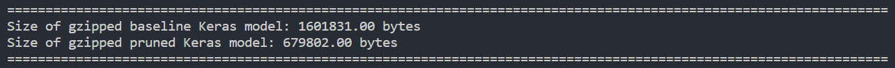
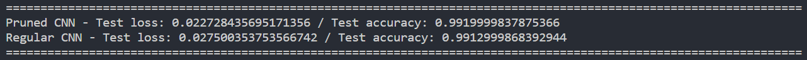

# Understanding and Implementing Pruning

This repository aims to study Pruning and its effects for Model Compression while also studying the changes in model accuracy. For this two python files have been created, each with its own aim.

## Comparing Model Size and Accuracy: Regular CNN vs. Pruned CNN 
File: PruningCompare.py
### Purpose:
- This script compares the model size and accuracy of a convolutional neural network (CNN) before and after applying pruning techniques.

### Steps:
1. **Data Loading and Preprocessing**:
   - Loads the MNIST dataset and preprocesses the input data for model training.

2. **Model Training (Regular CNN)**:
   - Constructs and trains a CNN model on the training dataset without any pruning.

3. **Model Evaluation (Regular CNN)**:
   - Evaluates the trained CNN model's accuracy on the test dataset and measures its test loss.

4. **Model Pruning**:
   - Applies pruning techniques to the trained CNN model to reduce its size and improve efficiency.

5. **Model Evaluation (Pruned CNN)**:
   - Evaluates the pruned CNN model's accuracy on the test dataset and measures its test loss.

6. **Model Export**:
   - Exports both the regular and pruned CNN models in compressed formats to measure their respective sizes.

7. **Quantization (Optional)**:
   - Converts the pruned CNN model into a quantized version using TensorFlow Lite to optimize it for deployment on edge devices.

8. **Measurement of Model Sizes**:
   - Measures the sizes of the regular and pruned CNN models in compressed formats to compare their size reduction.

### Observations:
- By comparing the accuracy and size of the regular CNN model with those of the pruned CNN model, users can assess the trade-offs between model complexity and efficiency. Pruning aims to achieve smaller model sizes while maintaining acceptable levels of accuracy, making it suitable for resource-constrained environments.

## Pruning Implementation in Keras

This script demonstrates the implementation of pruning in Keras using TensorFlow Model Optimization library. Pruning is a technique used to reduce the size of deep learning models by removing unnecessary parameters without significantly affecting performance.

### Setup
- The initial setup includes defining the model architecture and preparing training data.
- A random model is created with a single Dense layer and flattened.
- Training data is generated randomly.

### Pruning the Whole Model
- Pruning is applied to the entire model using `prune_low_magnitude`.
- We load pretrained weights (optional but recommended) and prune the model.
- Pruning parameters are applied, and the pruned model is summarized.

### Pruning Specific Layers
- Pruning is applied to specific layers by cloning the model and applying pruning to desired layers.
- The `apply_pruning_to_dense` function applies pruning to Dense layers.
- The cloned model with pruning is then summarized.

### Functional and Sequential API
- Pruning can be applied using both the Functional and Sequential APIs.
- Examples are provided for both APIs, demonstrating how to prune layers in each.

### Custom Keras Layer Pruning
- Custom Keras layers can also be pruned by subclassing and implementing the `PrunableLayer` interface.
- Example provided with a custom Dense layer.

### Training Pruned Model
- Pruned model is trained using regular Keras training methods.
- Callbacks are used for updating pruning steps and logging summaries for TensorBoard.

### Custom Training Loop
- Demonstrates how to integrate pruning callbacks into a custom training loop.
- Pruning steps and summaries are updated during each training iteration.

### Improving Pruned Model Accuracy
- Describes how to improve pruned model accuracy by saving and loading the optimizer state.
- Checkpointing is used to save the optimizer along with the model.

### Deploying Pruned Model
- Shows how to export the pruned model with size compression.
- Pruning is stripped from the model before exporting to see the compression benefits.